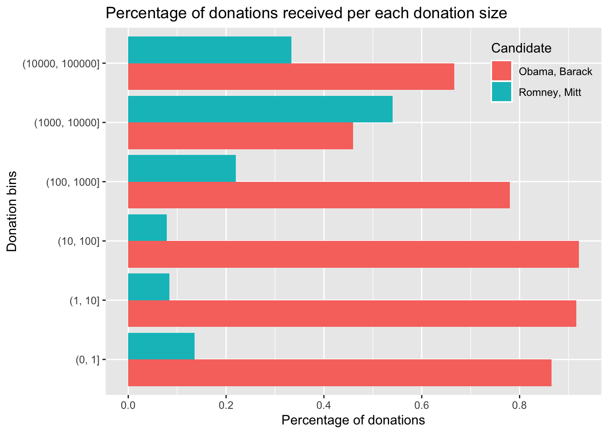
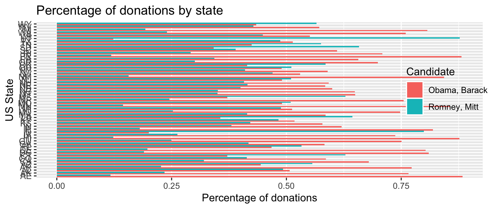

2012 Federal Election Commission Database
================
Roberto Preste
2019-01-13

From the book (chapter 14.5):

> The US Federal Election Commission publishes data on contributions to political campaigns. This includes contributor names, occupation and employer, address, and contribution amount. An interesting dataset is from the 2012 US presidential election.

------------------------------------------------------------------------

``` r
library(tidyverse)
library(magrittr)
```

------------------------------------------------------------------------

Loading the data
----------------

This is a version of the above-mentioned dataset downloaded in June 2012.

``` r
fec <- read_csv("../datasets/fec/P00000001-ALL.csv")
```

``` r
fec
```

    ## # A tibble: 1,001,731 x 16
    ##    cmte_id cand_id cand_nm contbr_nm contbr_city contbr_st contbr_zip
    ##    <chr>   <chr>   <chr>   <chr>     <chr>       <chr>     <chr>     
    ##  1 C00410… P20002… Bachma… HARVEY, … MOBILE      AL        366010290 
    ##  2 C00410… P20002… Bachma… HARVEY, … MOBILE      AL        366010290 
    ##  3 C00410… P20002… Bachma… SMITH, L… LANETT      AL        368633403 
    ##  4 C00410… P20002… Bachma… BLEVINS,… PIGGOTT     AR        724548253 
    ##  5 C00410… P20002… Bachma… WARDENBU… HOT SPRING… AR        719016467 
    ##  6 C00410… P20002… Bachma… BECKMAN,… SPRINGDALE  AR        727647190 
    ##  7 C00410… P20002… Bachma… BLEVINS,… PIGGOTT     AR        724548253 
    ##  8 C00410… P20002… Bachma… BLEVINS,… PIGGOTT     AR        724548253 
    ##  9 C00410… P20002… Bachma… COLLINS,… MESA        AZ        852106725 
    ## 10 C00410… P20002… Bachma… COLEMAN,… TUCSON      AZ        857498865 
    ## # ... with 1,001,721 more rows, and 9 more variables:
    ## #   contbr_employer <chr>, contbr_occupation <chr>,
    ## #   contb_receipt_amt <dbl>, contb_receipt_dt <chr>, receipt_desc <chr>,
    ## #   memo_cd <chr>, memo_text <chr>, form_tp <chr>, file_num <int>

We can add another column to report if the candidate is a Republican or Democrat. In order to do that, we will simply add `"Democrat"` to every Barack Obama entry, and `"Republican"` to all the others.

``` r
fec %<>% 
    mutate(party = case_when(cand_nm == "Obama, Barack" ~ "Democrat", 
                             TRUE ~ "Republican"))
```

Let's restrict the dataset to only positive contributions, removing refunds.

``` r
fec %<>% 
    filter(contb_receipt_amt > 0)
```

``` r
fec
```

    ## # A tibble: 991,475 x 17
    ##    cmte_id cand_id cand_nm contbr_nm contbr_city contbr_st contbr_zip
    ##    <chr>   <chr>   <chr>   <chr>     <chr>       <chr>     <chr>     
    ##  1 C00410… P20002… Bachma… HARVEY, … MOBILE      AL        366010290 
    ##  2 C00410… P20002… Bachma… HARVEY, … MOBILE      AL        366010290 
    ##  3 C00410… P20002… Bachma… SMITH, L… LANETT      AL        368633403 
    ##  4 C00410… P20002… Bachma… BLEVINS,… PIGGOTT     AR        724548253 
    ##  5 C00410… P20002… Bachma… WARDENBU… HOT SPRING… AR        719016467 
    ##  6 C00410… P20002… Bachma… BECKMAN,… SPRINGDALE  AR        727647190 
    ##  7 C00410… P20002… Bachma… BLEVINS,… PIGGOTT     AR        724548253 
    ##  8 C00410… P20002… Bachma… BLEVINS,… PIGGOTT     AR        724548253 
    ##  9 C00410… P20002… Bachma… COLLINS,… MESA        AZ        852106725 
    ## 10 C00410… P20002… Bachma… COLEMAN,… TUCSON      AZ        857498865 
    ## # ... with 991,465 more rows, and 10 more variables:
    ## #   contbr_employer <chr>, contbr_occupation <chr>,
    ## #   contb_receipt_amt <dbl>, contb_receipt_dt <chr>, receipt_desc <chr>,
    ## #   memo_cd <chr>, memo_text <chr>, form_tp <chr>, file_num <int>,
    ## #   party <chr>

Donation statistics by Occupation and Employer
----------------------------------------------

Let's see if there is any trend of donations amount based on donators occupation and employer.

``` r
fec %>% 
    group_by(contbr_occupation) %>% 
    summarise(count = n()) %>% 
    arrange(desc(count))
```

    ## # A tibble: 45,065 x 2
    ##    contbr_occupation                       count
    ##    <chr>                                   <int>
    ##  1 RETIRED                                233990
    ##  2 INFORMATION REQUESTED                   35107
    ##  3 ATTORNEY                                34286
    ##  4 HOMEMAKER                               29931
    ##  5 PHYSICIAN                               23432
    ##  6 INFORMATION REQUESTED PER BEST EFFORTS  21138
    ##  7 ENGINEER                                14334
    ##  8 TEACHER                                 13991
    ##  9 CONSULTANT                              13273
    ## 10 PROFESSOR                               12555
    ## # ... with 45,055 more rows

``` r
fec %>% 
    group_by(contbr_employer) %>% 
    summarise(count = n()) %>% 
    arrange(desc(count))
```

    ## # A tibble: 135,643 x 2
    ##    contbr_employer                         count
    ##    <chr>                                   <int>
    ##  1 RETIRED                                206675
    ##  2 SELF-EMPLOYED                           94505
    ##  3 NOT EMPLOYED                            45877
    ##  4 INFORMATION REQUESTED                   36135
    ##  5 SELF                                    24385
    ##  6 INFORMATION REQUESTED PER BEST EFFORTS  22260
    ##  7 NONE                                    19929
    ##  8 HOMEMAKER                               18269
    ##  9 N/A                                      6308
    ## 10 SELF EMPLOYED                            6274
    ## # ... with 135,633 more rows

We should clean a bit these data, because some of them refer to the same type of employment but are encoded differently.

``` r
fec %<>% mutate_if(is_character, str_replace_all, 
                   pattern = "INFORMATION REQUESTED PER BEST EFFORTS", 
                   replacement = "NOT PROVIDED")
fec %<>% mutate_if(is_character, str_replace_all, 
                   pattern = "INFORMATION REQUESTED", 
                   replacement = "NOT PROVIDED")
fec %<>% mutate_if(is_character, str_replace_all, 
                   pattern = "INFORMATION REQUESTED (BEST EFFORTS)", 
                   replacement = "NOT PROVIDED")
fec %<>% mutate_if(is_character, str_replace_all, 
                   pattern = "^NONE$", 
                   replacement = "NOT PROVIDED")
fec %<>% mutate_if(is_character, str_replace_all, 
                   pattern = "^REFUSED$", 
                   replacement = "NOT PROVIDED")
fec %<>% mutate_if(is_character, str_replace_all, 
                   pattern = "^REQUESTED$", 
                   replacement = "NOT PROVIDED")
fec %<>% replace_na(list(contbr_employer = "NOT PROVIDED", 
                         contbr_occupation = "NOT PROVIDED"))
fec %<>% mutate_if(is_character, str_replace_all, 
                   pattern = "^N/A$", 
                   replacement = "NOT PROVIDED") 
fec %<>% mutate_if(is_character, str_replace_all, 
                   pattern = "^C.E.O.$", 
                   replacement = "CEO")
fec %<>% mutate_if(is_character, str_replace_all, 
                   pattern = "^RN$", 
                   replacement = "REGISTERED NURSE") 
fec %<>% mutate_if(is_character, str_replace_all, 
                   pattern = "^R.N.$", 
                   replacement = "REGISTERED NURSE") 
fec %<>% mutate_if(is_character, str_replace_all, 
                   pattern = "^UNEMPLOYED$", 
                   replacement = "NOT EMPLOYED")
fec %<>% mutate_if(is_character, str_replace_all, 
                   pattern = "^SELF$", 
                   replacement = "SELF-EMPLOYED") 
fec %<>% mutate_if(is_character, str_replace_all, 
                   pattern = "SELF EMPLOYED", 
                   replacement = "SELF-EMPLOYED") 
```

``` r
fec %>% 
    group_by(contbr_occupation) %>% 
    summarise(count = n()) %>% 
    arrange(desc(count))
```

    ## # A tibble: 45,048 x 2
    ##    contbr_occupation  count
    ##    <chr>              <int>
    ##  1 RETIRED           233990
    ##  2 NOT PROVIDED       63840
    ##  3 ATTORNEY           34286
    ##  4 HOMEMAKER          29931
    ##  5 PHYSICIAN          23432
    ##  6 ENGINEER           14334
    ##  7 TEACHER            13991
    ##  8 CONSULTANT         13273
    ##  9 PROFESSOR          12555
    ## 10 NOT EMPLOYED       12335
    ## # ... with 45,038 more rows

``` r
fec %>% 
    group_by(contbr_employer) %>% 
    summarise(count = n()) %>% 
    arrange(desc(count))
```

    ## # A tibble: 135,628 x 2
    ##    contbr_employer    count
    ##    <chr>              <int>
    ##  1 RETIRED           206675
    ##  2 SELF-EMPLOYED     125164
    ##  3 NOT PROVIDED       90979
    ##  4 NOT EMPLOYED       48391
    ##  5 HOMEMAKER          18269
    ##  6 US ARMY             1817
    ##  7 STUDENT             1786
    ##  8 OBAMA FOR AMERICA   1741
    ##  9 IBM                 1428
    ## 10 DISABLED            1259
    ## # ... with 135,618 more rows

After this cleaning, let's create another dataset where we remove all candidates but Barack Obama and Mitt Romney, the main two candidates for this election.

``` r
fec_mrbo <- fec %>% 
    filter(cand_nm %in% c("Obama, Barack", "Romney, Mitt"))
```

``` r
fec_mrbo
```

    ## # A tibble: 694,282 x 17
    ##    cmte_id cand_id cand_nm contbr_nm contbr_city contbr_st contbr_zip
    ##    <chr>   <chr>   <chr>   <chr>     <chr>       <chr>     <chr>     
    ##  1 C00431… P80003… Romney… ELDERBAU… DPO         AA        340230183 
    ##  2 C00431… P80003… Romney… ELDERBAU… DPO         AA        340230183 
    ##  3 C00431… P80003… Romney… CARLSEN,… APO         AE        091280020 
    ##  4 C00431… P80003… Romney… DELUCA, … APO         AE        091280005 
    ##  5 C00431… P80003… Romney… SARGENT,… APO         AE        090120092 
    ##  6 C00431… P80003… Romney… WILSON, … DPO         AE        098700023 
    ##  7 C00431… P80003… Romney… GRIFFIS,… APO         AE        091280011 
    ##  8 C00431… P80003… Romney… SARGENT,… APO         AE        090120092 
    ##  9 C00431… P80003… Romney… GRIFFIS,… APO         AE        091280011 
    ## 10 C00431… P80003… Romney… DELUCA, … APO         AE        091280005 
    ## # ... with 694,272 more rows, and 10 more variables:
    ## #   contbr_employer <chr>, contbr_occupation <chr>,
    ## #   contb_receipt_amt <dbl>, contb_receipt_dt <chr>, receipt_desc <chr>,
    ## #   memo_cd <chr>, memo_text <chr>, form_tp <chr>, file_num <int>,
    ## #   party <chr>

Now we can aggregate the data by occupation and party, and further filter it to keep only occupations that donated over $2 million.

``` r
by_occupation <- fec %>% 
    group_by(contbr_occupation, party) %>% 
    summarise(donations = sum(contb_receipt_amt))
```

``` r
over_2mm <- by_occupation %>% 
    filter(donations >= 2000000)
```

Let's view these data.

``` r
over_2mm %>% 
    ggplot(aes(x = reorder(contbr_occupation, donations))) + 
    geom_col(aes(y = donations, fill = party), position = "dodge") + 
    coord_flip() +
    labs(x = "Occupation", y = "Donations (US$)", fill = "Party", 
         title = "Total donations by party per occupation") + 
    theme(legend.position = c(0.9, 0.14), 
          legend.background = element_rect(fill = "transparent"))
```


Now we might be interested in aggregating these data by candidate name and occupation or employer, to find the top 10 occupations and employers who donated to the two candidates.

``` r
occupation_grouped <- fec_mrbo %>% 
    group_by(cand_nm, contbr_occupation) %>% 
    summarise(donations = sum(contb_receipt_amt))
top_10_occup <- top_n(occupation_grouped, 10, donations)
```

``` r
employer_grouped <- fec_mrbo %>% 
    group_by(cand_nm, contbr_employer) %>% 
    summarise(donations = sum(contb_receipt_amt))
top_10_empl <- top_n(employer_grouped, 10, donations)
```

Let's now visualize these two sets.

``` r
top_10_occup %>% 
    ggplot(aes(x = reorder(contbr_occupation, donations))) + 
    geom_col(aes(y = donations, fill = cand_nm), position = "dodge") + 
    coord_flip() + 
    labs(x = "Occupation", y = "Donations (US$)", fill = "Candidate", 
         title = "Top 10 donating occupations") + 
    theme(legend.position = c(0.88, 0.14), 
          legend.background = element_rect(fill = "transparent"))
```


``` r
top_10_empl %>% 
    ggplot(aes(x = reorder(contbr_employer, donations))) + 
    geom_col(aes(y = donations, fill = cand_nm), position = "dodge") + 
    coord_flip() + 
    labs(x = "Employer", y = "Donations (US$)", fill = "Candidate", 
         title = "Top 10 donating employers") + 
    theme(legend.position = c(0.86, 0.14), 
          legend.background = element_rect(fill = "transparent"))
```


Bucketing donation amounts
--------------------------

We can discretize the contribution amounts into bins describing the contribution size.

``` r
fec_mrbo %<>% 
    mutate(contb_bin = cut(contb_receipt_amt, 
                           breaks = c(0, 1, 10, 100, 1000, 10000, 100000, 1000000, 10000000)))
```

Now it is possible to aggregate these data by candidate and contribution bin, to get a histogram by donation size.

``` r
contrib_grouped <- fec_mrbo %>% 
    group_by(contb_bin, cand_nm) %>% 
    summarise(donations = n()) %>% 
    mutate(donation_perc = donations / sum(donations))
```

``` r
contrib_grouped 
```

    ## # A tibble: 14 x 4
    ## # Groups:   contb_bin [8]
    ##    contb_bin     cand_nm       donations donation_perc
    ##    <fct>         <chr>             <int>         <dbl>
    ##  1 (0,1]         Obama, Barack       493        0.865 
    ##  2 (0,1]         Romney, Mitt         77        0.135 
    ##  3 (1,10]        Obama, Barack     40070        0.916 
    ##  4 (1,10]        Romney, Mitt       3681        0.0841
    ##  5 (10,100]      Obama, Barack    372280        0.921 
    ##  6 (10,100]      Romney, Mitt      31853        0.0788
    ##  7 (100,1e+03]   Obama, Barack    153991        0.780 
    ##  8 (100,1e+03]   Romney, Mitt      43357        0.220 
    ##  9 (1e+03,1e+04] Obama, Barack     22284        0.460 
    ## 10 (1e+03,1e+04] Romney, Mitt      26186        0.540 
    ## 11 (1e+04,1e+05] Obama, Barack         2        0.667 
    ## 12 (1e+04,1e+05] Romney, Mitt          1        0.333 
    ## 13 (1e+05,1e+06] Obama, Barack         3        1     
    ## 14 (1e+06,1e+07] Obama, Barack         4        1

``` r
contrib_grouped %>% 
    filter(donation_perc != 1.0) %>% 
    ggplot(aes(x = contb_bin)) + 
    geom_col(aes(y = donation_perc, fill = cand_nm), position = "dodge") + 
    coord_flip() + 
    labs(x = "Donation bins", y = "Percentage of donations", fill = "Candidate", 
         title = "Percentage of donations received per each donation size") + 
    scale_x_discrete(labels = c("(0, 1]", "(1, 10]", "(10, 100]", "(100, 1000]", "(1000, 10000]", "(10000, 100000]")) + 
    scale_y_continuous(breaks = c(0.0, 0.2, 0.4, 0.6, 0.8)) + 
    theme(legend.position = c(0.88, 0.88), 
          legend.background = element_rect(fill = "transparent"))
```



Donation statistics by State
----------------------------

Let's aggregate the data by candidate name and state.

``` r
state_grouped <- fec_mrbo %>% 
    group_by(contbr_st, cand_nm) %>% 
    summarise(donations = sum(contb_receipt_amt)) %>% 
    mutate(donation_perc = donations / sum(donations))
```

``` r
state_grouped
```

    ## # A tibble: 126 x 4
    ## # Groups:   contbr_st [68]
    ##    contbr_st cand_nm       donations donation_perc
    ##    <chr>     <chr>             <dbl>         <dbl>
    ##  1 AA        Obama, Barack    56405        0.998  
    ##  2 AA        Romney, Mitt       135        0.00239
    ##  3 AB        Obama, Barack     2048        1      
    ##  4 AE        Obama, Barack    42974.       0.883  
    ##  5 AE        Romney, Mitt      5680        0.117  
    ##  6 AK        Obama, Barack   281840.       0.766  
    ##  7 AK        Romney, Mitt     86204.       0.234  
    ##  8 AL        Obama, Barack   543123.       0.507  
    ##  9 AL        Romney, Mitt    527304.       0.493  
    ## 10 AP        Obama, Barack    37130.       0.957  
    ## # ... with 116 more rows

And finally a (quite messy) visualization of these data.

``` r
state_grouped %>% 
    filter(donation_perc != 1.0, donation_perc >= 0.1, donation_perc <= 0.9) %>% 
    ggplot(aes(x = contbr_st)) + 
    geom_col(aes(y = donation_perc, fill = cand_nm), position = "dodge") + 
    coord_flip() + 
    labs(x = "US State", y = "Percentage of donations", fill = "Candidate", 
         title = "Percentage of donations by state") + 
    theme(legend.position = c(0.92, 0.56), 
          legend.background = element_rect(fill = "transparent"))
```



------------------------------------------------------------------------

``` r
sessionInfo()
```

    ## R version 3.5.1 (2018-07-02)
    ## Platform: x86_64-apple-darwin15.6.0 (64-bit)
    ## Running under: macOS  10.14.2
    ## 
    ## Matrix products: default
    ## BLAS: /Library/Frameworks/R.framework/Versions/3.5/Resources/lib/libRblas.0.dylib
    ## LAPACK: /Library/Frameworks/R.framework/Versions/3.5/Resources/lib/libRlapack.dylib
    ## 
    ## locale:
    ## [1] en_GB.UTF-8/en_GB.UTF-8/en_GB.UTF-8/C/en_GB.UTF-8/en_GB.UTF-8
    ## 
    ## attached base packages:
    ## [1] stats     graphics  grDevices utils     datasets  methods   base     
    ## 
    ## other attached packages:
    ##  [1] bindrcpp_0.2.2  magrittr_1.5    forcats_0.3.0   stringr_1.3.1  
    ##  [5] dplyr_0.7.7     purrr_0.2.5     readr_1.1.1     tidyr_0.8.1    
    ##  [9] tibble_1.4.2    ggplot2_3.1.0   tidyverse_1.2.1
    ## 
    ## loaded via a namespace (and not attached):
    ##  [1] Rcpp_1.0.0       cellranger_1.1.0 pillar_1.3.0     compiler_3.5.1  
    ##  [5] plyr_1.8.4       bindr_0.1.1      tools_3.5.1      digest_0.6.18   
    ##  [9] lubridate_1.7.4  jsonlite_1.5     evaluate_0.11    nlme_3.1-137    
    ## [13] gtable_0.2.0     lattice_0.20-35  pkgconfig_2.0.2  rlang_0.3.0.1   
    ## [17] cli_1.0.0        rstudioapi_0.8   yaml_2.2.0       haven_1.1.2     
    ## [21] withr_2.1.2      xml2_1.2.0       httr_1.3.1       knitr_1.20      
    ## [25] hms_0.4.2        rprojroot_1.3-2  grid_3.5.1       tidyselect_0.2.5
    ## [29] glue_1.3.0       R6_2.3.0         fansi_0.3.0      readxl_1.1.0    
    ## [33] rmarkdown_1.10   modelr_0.1.2     backports_1.1.2  scales_1.0.0    
    ## [37] htmltools_0.3.6  rvest_0.3.2      assertthat_0.2.0 colorspace_1.3-2
    ## [41] labeling_0.3     utf8_1.1.4       stringi_1.2.4    lazyeval_0.2.1  
    ## [45] munsell_0.5.0    broom_0.5.0      crayon_1.3.4
