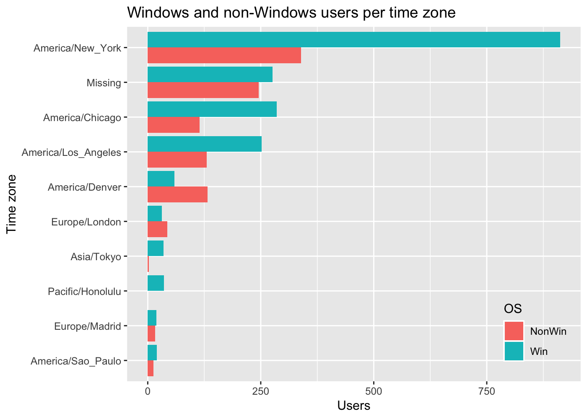
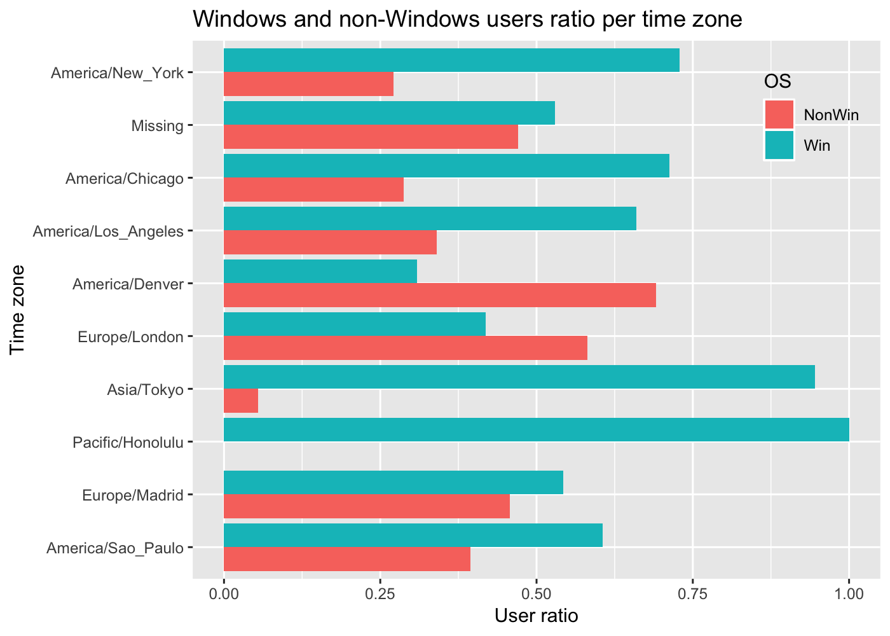

USA.gov Data from Bitly
================
Roberto Preste
2019-01-13

From the book (chapter 14.1):

> In 2011, URL shortening service [Bitly](https://bitly.com/) partnered with the US government website [USA.gov](https://www.usa.gov/) to provide a feed of anonymous data gathered from users who shorten links ending with .gov or .mil. In 2011, a live feed as well as hourly snapshots were available as downloadable text files. This service is shut down at the time of this writing (2017)

------------------------------------------------------------------------

``` r
library(tidyverse)
library(magrittr)
library(jsonlite)
```

------------------------------------------------------------------------

Loading the data
----------------

The dataset is in [JSON](https://www.json.org) format, so it is imported using the `jsonlite` package. Its `fromJSON` function however does not work in this case, since this is a NDJSON file, meaning that multiple JSON objects are contained in the same file.
We will use the `stream_in` function to load the dataset instead.

``` r
path <- "../datasets/bitly_usagov/example.txt"
records <- stream_in(file(path))
```

    ## 
     Found 500 records...
     Found 1000 records...
     Found 1500 records...
     Found 2000 records...
     Found 2500 records...
     Found 3000 records...
     Found 3500 records...
     Found 3560 records...
     Imported 3560 records. Simplifying...

Let's convert the `records` object to a tibble.

``` r
records %<>% as_tibble()
```

``` r
records
```

    ## # A tibble: 3,560 x 18
    ##    a     c        nk tz    gr    g     h     l     al    hh    r     u    
    ##  * <chr> <chr> <int> <chr> <chr> <chr> <chr> <chr> <chr> <chr> <chr> <chr>
    ##  1 Mozi… US        1 Amer… MA    A6qO… wfLQ… orof… en-U… 1.us… http… http…
    ##  2 Goog… US        0 Amer… UT    mwsz… mwsz… bitly <NA>  j.mp  http… http…
    ##  3 Mozi… US        1 Amer… DC    xxr3… xxr3… bitly en-US 1.us… http… http…
    ##  4 Mozi… BR        0 Amer… 27    zCaL… zUtu… alel… pt-br 1.us… dire… http…
    ##  5 Mozi… US        0 Amer… MA    9b6k… 9b6k… bitly en-U… bit.… http… http…
    ##  6 Mozi… US        0 Amer… MA    axNK… axNK… bitly en-U… bit.… http… http…
    ##  7 Mozi… PL        0 Euro… 77    wcnd… zkpJ… bnja… pl-P… 1.us… http… http…
    ##  8 Mozi… <NA>      0 ""    <NA>  wcnd… zkpJ… bnja… bg,e… 1.us… http… http…
    ##  9 Oper… <NA>      0 ""    <NA>  wcnd… zkpJ… bnja… en-U… 1.us… http… http…
    ## 10 Mozi… <NA>      0 ""    <NA>  zCaL… zUtu… alel… pt-B… 1.us… http… http…
    ## # ... with 3,550 more rows, and 6 more variables: t <int>, hc <int>,
    ## #   cy <chr>, ll <list>, `_heartbeat_` <int>, kw <chr>

Counting time zones
-------------------

We may be interested in counting the most often-occurring time zones.

``` r
tz_counts <- records %>% 
    count(tz) 
```

``` r
tz_counts
```

    ## # A tibble: 98 x 2
    ##    tz                                 n
    ##    <chr>                          <int>
    ##  1 ""                               521
    ##  2 Africa/Cairo                       3
    ##  3 Africa/Casablanca                  1
    ##  4 Africa/Ceuta                       2
    ##  5 Africa/Johannesburg                1
    ##  6 Africa/Lusaka                      1
    ##  7 America/Anchorage                  5
    ##  8 America/Argentina/Buenos_Aires     1
    ##  9 America/Argentina/Cordoba          1
    ## 10 America/Argentina/Mendoza          1
    ## # ... with 88 more rows

There are some missing values, so let's first replace them.

``` r
records %<>% 
    mutate(tz = replace(tz, tz == "", "Missing"))
records$tz %<>% 
    replace_na("Unknown")
```

``` r
tz_counts <- records %>% 
    count(tz) 
```

``` r
tz_counts
```

    ## # A tibble: 98 x 2
    ##    tz                                 n
    ##    <chr>                          <int>
    ##  1 Africa/Cairo                       3
    ##  2 Africa/Casablanca                  1
    ##  3 Africa/Ceuta                       2
    ##  4 Africa/Johannesburg                1
    ##  5 Africa/Lusaka                      1
    ##  6 America/Anchorage                  5
    ##  7 America/Argentina/Buenos_Aires     1
    ##  8 America/Argentina/Cordoba          1
    ##  9 America/Argentina/Mendoza          1
    ## 10 America/Bogota                     3
    ## # ... with 88 more rows

Now we can sort entries in descending order.

``` r
tz_counts %<>%  
    arrange(desc(n))
```

Let's plot a bar chart with the first 10 entries from `tz_counts`.

``` r
head(tz_counts, n = 10) %>% 
    ggplot(aes(x = reorder(tz, n), y = n, fill = tz)) + 
    geom_col() + 
    coord_flip() + 
    guides(fill = F) + 
    labs(title = "Top time zones", x = "Time zone", y = "Count") 
```


Let's parse the `a` column to get some information about the most commonly used browsers.

``` r
records %<>%  
    mutate(browsers = str_split_fixed(records$a, " ", n = 2)[, 1])
```

``` r
records %>% 
    count(browsers) %>% 
    arrange(desc(n))
```

    ## # A tibble: 37 x 2
    ##    browsers                     n
    ##    <chr>                    <int>
    ##  1 Mozilla/5.0               2594
    ##  2 Mozilla/4.0                601
    ##  3 GoogleMaps/RochesterNY     121
    ##  4 ""                         120
    ##  5 Opera/9.80                  34
    ##  6 TEST_INTERNET_AGENT         24
    ##  7 GoogleProducer              21
    ##  8 Mozilla/6.0                  5
    ##  9 BlackBerry8520/5.0.0.681     4
    ## 10 BlackBerry8520/5.0.0.592     3
    ## # ... with 27 more rows

Now we want to decompose time zones into Windows and non-Windows users. We can achieve that by looking at the `a` variable, checking whether it contains the `Windows` string or not. Some of the browser agents are missing, so we'll first drop rows where the `a` column is empty.

``` r
records_notnull <- records %>% 
    drop_na(a)
```

Then we'll create a new column, `os`, which will contain the `Win` value for Windows users and `NonWin` otherwise.

``` r
records_notnull %<>%  
    mutate(os = case_when(str_detect(a, "Windows") ~ "Win", 
                          TRUE ~ "NonWin"))
```

Now we'll aggregate these results to show the count of Windows and non-Windows users for each time zone.

``` r
agg_counts <- records_notnull %>% 
    group_by(tz, os) %>% 
    summarise(Users = n()) %>% 
    spread(os, Users, fill = 0)
```

``` r
agg_counts
```

    ## # A tibble: 97 x 3
    ## # Groups:   tz [97]
    ##    tz                             NonWin   Win
    ##    <chr>                           <dbl> <dbl>
    ##  1 Africa/Cairo                        0     3
    ##  2 Africa/Casablanca                   0     1
    ##  3 Africa/Ceuta                        0     2
    ##  4 Africa/Johannesburg                 0     1
    ##  5 Africa/Lusaka                       0     1
    ##  6 America/Anchorage                   4     1
    ##  7 America/Argentina/Buenos_Aires      1     0
    ##  8 America/Argentina/Cordoba           0     1
    ##  9 America/Argentina/Mendoza           0     1
    ## 10 America/Bogota                      1     2
    ## # ... with 87 more rows

Let's add a `total` column that will be useful to sort our data based on the total number of users; for visualization purposes, we'll take the first 10 entries in this list.

``` r
agg_counts %<>%  
    mutate(total = sum(NonWin, Win)) %>% 
    arrange(desc(total))

agg_counts_top10 <- agg_counts[1:10, ]
```

In order to visualize these data, let's gather again `Win` and `NonWin` counts per each time zone.

``` r
count_subset <- agg_counts_top10 %>% 
    gather(key = "os", value = "users", Win, NonWin) %>% 
    arrange(tz, users) %>% 
    select(-total)
```

Now we can plot these data.

``` r
count_subset %>% 
    ggplot(aes(x = reorder(tz, users), y = users, fill = os)) + 
    geom_col(position = "dodge") + 
    coord_flip() + 
    labs(x = "Time zone", y = "Users", 
         title = "Windows and non-Windows users per time zone", fill = "OS") + 
    theme(legend.position = c(0.9, 0.14), 
          legend.background = element_rect(fill = "transparent"))
```



Let's normalize the count of users so the sum of Windows and non-Windows users is 1.

``` r
count_subset %<>% 
    group_by(tz, os) %>% 
    summarise(users = users) %>% 
    mutate(normed_total = users / sum(users))
```

Now we can plot these normalized data.

``` r
count_subset %>% 
    ggplot(aes(x = reorder(tz, users), y = normed_total, fill = os)) + 
    geom_col(position = "dodge") + 
    coord_flip() + 
    labs(x = "Time zone", y = "User ratio", 
         title = "Windows and non-Windows users ratio per time zone", fill = "OS") + 
    theme(legend.position = c(0.9, 0.86), 
          legend.background = element_rect(fill = "transparent"))
```



------------------------------------------------------------------------

``` r
sessionInfo()
```

    ## R version 3.5.1 (2018-07-02)
    ## Platform: x86_64-apple-darwin15.6.0 (64-bit)
    ## Running under: macOS  10.14.2
    ## 
    ## Matrix products: default
    ## BLAS: /Library/Frameworks/R.framework/Versions/3.5/Resources/lib/libRblas.0.dylib
    ## LAPACK: /Library/Frameworks/R.framework/Versions/3.5/Resources/lib/libRlapack.dylib
    ## 
    ## locale:
    ## [1] en_GB.UTF-8/en_GB.UTF-8/en_GB.UTF-8/C/en_GB.UTF-8/en_GB.UTF-8
    ## 
    ## attached base packages:
    ## [1] stats     graphics  grDevices utils     datasets  methods   base     
    ## 
    ## other attached packages:
    ##  [1] bindrcpp_0.2.2  jsonlite_1.5    magrittr_1.5    forcats_0.3.0  
    ##  [5] stringr_1.3.1   dplyr_0.7.7     purrr_0.2.5     readr_1.1.1    
    ##  [9] tidyr_0.8.1     tibble_1.4.2    ggplot2_3.1.0   tidyverse_1.2.1
    ## 
    ## loaded via a namespace (and not attached):
    ##  [1] Rcpp_1.0.0       cellranger_1.1.0 pillar_1.3.0     compiler_3.5.1  
    ##  [5] plyr_1.8.4       bindr_0.1.1      tools_3.5.1      digest_0.6.18   
    ##  [9] lubridate_1.7.4  evaluate_0.11    nlme_3.1-137     gtable_0.2.0    
    ## [13] lattice_0.20-35  pkgconfig_2.0.2  rlang_0.3.0.1    cli_1.0.0       
    ## [17] rstudioapi_0.8   yaml_2.2.0       haven_1.1.2      withr_2.1.2     
    ## [21] xml2_1.2.0       httr_1.3.1       knitr_1.20       hms_0.4.2       
    ## [25] rprojroot_1.3-2  grid_3.5.1       tidyselect_0.2.5 glue_1.3.0      
    ## [29] R6_2.3.0         fansi_0.3.0      readxl_1.1.0     rmarkdown_1.10  
    ## [33] modelr_0.1.2     backports_1.1.2  scales_1.0.0     htmltools_0.3.6 
    ## [37] rvest_0.3.2      assertthat_0.2.0 colorspace_1.3-2 labeling_0.3    
    ## [41] utf8_1.1.4       stringi_1.2.4    lazyeval_0.2.1   munsell_0.5.0   
    ## [45] broom_0.5.0      crayon_1.3.4
