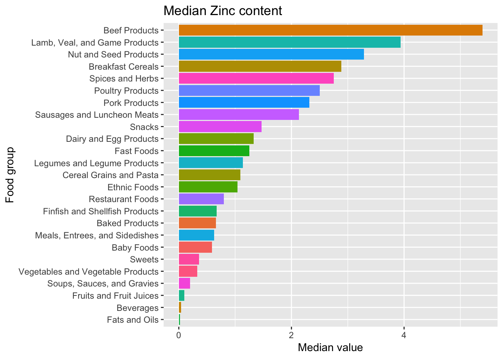

USDA Food Database
================
Roberto Preste
2019-01-13

From the book (chapter 14.4):

> The US Department of Agriculture makes available a database of food nutrient information. Programmer Ashley Williams made available a version of this database in JSON format.

------------------------------------------------------------------------

``` r
library(tidyverse)
library(magrittr)
library(jsonlite)
```

------------------------------------------------------------------------

Loading the data
----------------

This data come from the US Department of Agriculture and report a set of food nutrient information. These data were made available by Ashley Williams in JSON format, where each food has a number of identifying attributes along with two lists of nutrients and portion sizes.

``` r
path <- "../datasets/usda_food/database.json"
db <- as_tibble(fromJSON(path, flatten = T))
```

``` r
db
```

    ## # A tibble: 6,636 x 7
    ##       id description       tags   manufacturer group  portions  nutrients 
    ##  * <int> <chr>             <list> <chr>        <chr>  <list>    <list>    
    ##  1  1008 Cheese, caraway   <chr … ""           Dairy… <data.fr… <data.fra…
    ##  2  1009 Cheese, cheddar   <chr … ""           Dairy… <data.fr… <data.fra…
    ##  3  1018 Cheese, edam      <chr … ""           Dairy… <data.fr… <data.fra…
    ##  4  1019 Cheese, feta      <chr … ""           Dairy… <data.fr… <data.fra…
    ##  5  1028 Cheese, mozzarel… <chr … ""           Dairy… <data.fr… <data.fra…
    ##  6  1029 Cheese, mozzarel… <chr … ""           Dairy… <data.fr… <data.fra…
    ##  7  1038 Cheese, romano    <chr … ""           Dairy… <data.fr… <data.fra…
    ##  8  1039 Cheese, roquefort <chr … ""           Dairy… <data.fr… <data.fra…
    ##  9  1048 Cheese spread, p… <chr … ""           Dairy… <data.fr… <data.fra…
    ## 10  1049 Cream, fluid, ha… <chr … ""           Dairy… <data.fr… <data.fra…
    ## # ... with 6,626 more rows

Some of the features in this dataset are actually nested dataframes, as in `nutrients`.

``` r
db[[1, "nutrients"]]
```

    ##        value   units                        description       group
    ## 1     25.180       g                            Protein Composition
    ## 2     29.200       g                  Total lipid (fat) Composition
    ## 3      3.060       g        Carbohydrate, by difference Composition
    ## 4      3.280       g                                Ash       Other
    ## 5    376.000    kcal                             Energy      Energy
    ## 6     39.280       g                              Water Composition
    ## 7   1573.000      kJ                             Energy      Energy
    ## 8      0.000       g               Fiber, total dietary Composition
    ## 9    673.000      mg                        Calcium, Ca    Elements
    ## 10     0.640      mg                           Iron, Fe    Elements
    ## 11    22.000      mg                      Magnesium, Mg    Elements
    ## 12   490.000      mg                      Phosphorus, P    Elements
    ## 13    93.000      mg                       Potassium, K    Elements
    ## 14   690.000      mg                         Sodium, Na    Elements
    ## 15     2.940      mg                           Zinc, Zn    Elements
    ## 16     0.024      mg                         Copper, Cu    Elements
    ## 17     0.021      mg                      Manganese, Mn    Elements
    ## 18    14.500     mcg                       Selenium, Se    Elements
    ## 19  1054.000      IU                      Vitamin A, IU    Vitamins
    ## 20   262.000     mcg                            Retinol    Vitamins
    ## 21   271.000 mcg_RAE                     Vitamin A, RAE    Vitamins
    ## 22     0.000      mg     Vitamin C, total ascorbic acid    Vitamins
    ## 23     0.031      mg                            Thiamin    Vitamins
    ## 24     0.450      mg                         Riboflavin    Vitamins
    ## 25     0.180      mg                             Niacin    Vitamins
    ## 26     0.190      mg                   Pantothenic acid    Vitamins
    ## 27     0.074      mg                        Vitamin B-6    Vitamins
    ## 28    18.000     mcg                      Folate, total    Vitamins
    ## 29     0.270     mcg                       Vitamin B-12    Vitamins
    ## 30     0.000     mcg                         Folic acid    Vitamins
    ## 31    18.000     mcg                       Folate, food    Vitamins
    ## 32    18.000 mcg_DFE                        Folate, DFE    Vitamins
    ## 33    93.000      mg                        Cholesterol       Other
    ## 34    18.584       g       Fatty acids, total saturated       Other
    ## 35     8.275       g Fatty acids, total monounsaturated       Other
    ## 36     0.830       g Fatty acids, total polyunsaturated       Other
    ## 37     0.324       g                         Tryptophan Amino Acids
    ## 38     0.896       g                          Threonine Amino Acids
    ## 39     1.563       g                         Isoleucine Amino Acids
    ## 40     2.412       g                            Leucine Amino Acids
    ## 41     2.095       g                             Lysine Amino Acids
    ## 42     0.659       g                         Methionine Amino Acids
    ## 43     0.126       g                            Cystine Amino Acids
    ## 44     1.326       g                      Phenylalanine Amino Acids
    ## 45     1.216       g                           Tyrosine Amino Acids
    ## 46     1.682       g                             Valine Amino Acids
    ## 47     0.952       g                           Arginine Amino Acids
    ## 48     0.884       g                          Histidine Amino Acids
    ## 49     0.711       g                            Alanine Amino Acids
    ## 50     1.618       g                      Aspartic acid Amino Acids
    ## 51     6.160       g                      Glutamic acid Amino Acids
    ## 52     0.439       g                            Glycine Amino Acids
    ## 53     2.838       g                            Proline Amino Acids
    ## 54     1.472       g                             Serine Amino Acids
    ## 55    25.180       g                            Protein Composition
    ## 56    29.200       g                  Total lipid (fat) Composition
    ## 57     3.060       g        Carbohydrate, by difference Composition
    ## 58     3.280       g                                Ash       Other
    ## 59   376.000    kcal                             Energy      Energy
    ## 60    39.280       g                              Water Composition
    ## 61  1573.000      kJ                             Energy      Energy
    ## 62     0.000       g               Fiber, total dietary Composition
    ## 63   673.000      mg                        Calcium, Ca    Elements
    ## 64     0.640      mg                           Iron, Fe    Elements
    ## 65    22.000      mg                      Magnesium, Mg    Elements
    ## 66   490.000      mg                      Phosphorus, P    Elements
    ## 67    93.000      mg                       Potassium, K    Elements
    ## 68   690.000      mg                         Sodium, Na    Elements
    ## 69     2.940      mg                           Zinc, Zn    Elements
    ## 70     0.024      mg                         Copper, Cu    Elements
    ## 71     0.021      mg                      Manganese, Mn    Elements
    ## 72    14.500     mcg                       Selenium, Se    Elements
    ## 73  1054.000      IU                      Vitamin A, IU    Vitamins
    ## 74   262.000     mcg                            Retinol    Vitamins
    ## 75   271.000 mcg_RAE                     Vitamin A, RAE    Vitamins
    ## 76     0.000      mg     Vitamin C, total ascorbic acid    Vitamins
    ## 77     0.031      mg                            Thiamin    Vitamins
    ## 78     0.450      mg                         Riboflavin    Vitamins
    ## 79     0.180      mg                             Niacin    Vitamins
    ## 80     0.190      mg                   Pantothenic acid    Vitamins
    ## 81     0.074      mg                        Vitamin B-6    Vitamins
    ## 82    18.000     mcg                      Folate, total    Vitamins
    ## 83     0.270     mcg                       Vitamin B-12    Vitamins
    ## 84     0.000     mcg                         Folic acid    Vitamins
    ## 85    18.000     mcg                       Folate, food    Vitamins
    ## 86    18.000 mcg_DFE                        Folate, DFE    Vitamins
    ## 87     0.324       g                         Tryptophan Amino Acids
    ## 88     0.896       g                          Threonine Amino Acids
    ## 89     1.563       g                         Isoleucine Amino Acids
    ## 90     2.412       g                            Leucine Amino Acids
    ## 91     2.095       g                             Lysine Amino Acids
    ## 92     0.659       g                         Methionine Amino Acids
    ## 93     0.126       g                            Cystine Amino Acids
    ## 94     1.326       g                      Phenylalanine Amino Acids
    ## 95     1.216       g                           Tyrosine Amino Acids
    ## 96     1.682       g                             Valine Amino Acids
    ## 97     0.952       g                           Arginine Amino Acids
    ## 98     0.884       g                          Histidine Amino Acids
    ## 99     0.711       g                            Alanine Amino Acids
    ## 100    1.618       g                      Aspartic acid Amino Acids
    ## 101    6.160       g                      Glutamic acid Amino Acids
    ## 102    0.439       g                            Glycine Amino Acids
    ## 103    2.838       g                            Proline Amino Acids
    ## 104    1.472       g                             Serine Amino Acids
    ## 105   93.000      mg                        Cholesterol       Other
    ## 106   18.584       g       Fatty acids, total saturated       Other
    ## 107    8.275       g Fatty acids, total monounsaturated       Other
    ## 108    0.830       g Fatty acids, total polyunsaturated       Other
    ## 109   25.180       g                            Protein Composition
    ## 110   29.200       g                  Total lipid (fat) Composition
    ## 111    3.060       g        Carbohydrate, by difference Composition
    ## 112    3.280       g                                Ash       Other
    ## 113  376.000    kcal                             Energy      Energy
    ## 114   39.280       g                              Water Composition
    ## 115 1573.000      kJ                             Energy      Energy
    ## 116    0.000       g               Fiber, total dietary Composition
    ## 117  673.000      mg                        Calcium, Ca    Elements
    ## 118    0.640      mg                           Iron, Fe    Elements
    ## 119   22.000      mg                      Magnesium, Mg    Elements
    ## 120  490.000      mg                      Phosphorus, P    Elements
    ## 121   93.000      mg                       Potassium, K    Elements
    ## 122  690.000      mg                         Sodium, Na    Elements
    ## 123    2.940      mg                           Zinc, Zn    Elements
    ## 124    0.024      mg                         Copper, Cu    Elements
    ## 125    0.021      mg                      Manganese, Mn    Elements
    ## 126   14.500     mcg                       Selenium, Se    Elements
    ## 127 1054.000      IU                      Vitamin A, IU    Vitamins
    ## 128  262.000     mcg                            Retinol    Vitamins
    ## 129  271.000 mcg_RAE                     Vitamin A, RAE    Vitamins
    ## 130    0.000      mg     Vitamin C, total ascorbic acid    Vitamins
    ## 131    0.031      mg                            Thiamin    Vitamins
    ## 132    0.450      mg                         Riboflavin    Vitamins
    ## 133    0.180      mg                             Niacin    Vitamins
    ## 134    0.190      mg                   Pantothenic acid    Vitamins
    ## 135    0.074      mg                        Vitamin B-6    Vitamins
    ## 136   18.000     mcg                      Folate, total    Vitamins
    ## 137    0.270     mcg                       Vitamin B-12    Vitamins
    ## 138    0.000     mcg                         Folic acid    Vitamins
    ## 139   18.000     mcg                       Folate, food    Vitamins
    ## 140   18.000 mcg_DFE                        Folate, DFE    Vitamins
    ## 141    0.324       g                         Tryptophan Amino Acids
    ## 142    0.896       g                          Threonine Amino Acids
    ## 143    1.563       g                         Isoleucine Amino Acids
    ## 144    2.412       g                            Leucine Amino Acids
    ## 145    2.095       g                             Lysine Amino Acids
    ## 146    0.659       g                         Methionine Amino Acids
    ## 147    0.126       g                            Cystine Amino Acids
    ## 148    1.326       g                      Phenylalanine Amino Acids
    ## 149    1.216       g                           Tyrosine Amino Acids
    ## 150    1.682       g                             Valine Amino Acids
    ## 151    0.952       g                           Arginine Amino Acids
    ## 152    0.884       g                          Histidine Amino Acids
    ## 153    0.711       g                            Alanine Amino Acids
    ## 154    1.618       g                      Aspartic acid Amino Acids
    ## 155    6.160       g                      Glutamic acid Amino Acids
    ## 156    0.439       g                            Glycine Amino Acids
    ## 157    2.838       g                            Proline Amino Acids
    ## 158    1.472       g                             Serine Amino Acids
    ## 159   93.000      mg                        Cholesterol       Other
    ## 160   18.584       g       Fatty acids, total saturated       Other
    ## 161    8.275       g Fatty acids, total monounsaturated       Other
    ## 162    0.830       g Fatty acids, total polyunsaturated       Other

Without going too much in details, let's grep a subset of these information by selecting the `id`, `description`, `group` and `manufacturer` columns. In addition, we will rename the `description` and `group` columns to `food` and `fgroup`, respectively.

``` r
info <- db %>% 
    select(id, description, group, manufacturer) %>% 
    rename(food = description, fgroup = group)
```

Now let's see the distribution of food groups.

``` r
info %>% count(fgroup, sort = T)
```

    ## # A tibble: 25 x 2
    ##    fgroup                                n
    ##    <chr>                             <int>
    ##  1 Vegetables and Vegetable Products   812
    ##  2 Beef Products                       618
    ##  3 Baked Products                      496
    ##  4 Breakfast Cereals                   403
    ##  5 Fast Foods                          365
    ##  6 Legumes and Legume Products         365
    ##  7 Lamb, Veal, and Game Products       345
    ##  8 Sweets                              341
    ##  9 Fruits and Fruit Juices             328
    ## 10 Pork Products                       328
    ## # ... with 15 more rows

Let's collect all of the nutrients into a single dataframe. First we will create a vector with the ids that will then be added to each nutrient dataframe.

``` r
ids <- c()
for (elem in db$id) {
    ids <- append(ids, rep(elem, dim(subset(db, id == elem)[["nutrients"]][[1]])[1]))
}
```

``` r
nutr_rows <- bind_rows(db$nutrients)
```

``` r
nutrients <- 
    bind_cols(id = ids, nutr_rows) %>% 
    rename(nutrient = description, nutgroup = group)
```

``` r
nutrients
```

    ## # A tibble: 389,355 x 5
    ##       id   value units nutrient                    nutgroup   
    ##    <int>   <dbl> <chr> <chr>                       <chr>      
    ##  1  1008   25.2  g     Protein                     Composition
    ##  2  1008   29.2  g     Total lipid (fat)           Composition
    ##  3  1008    3.06 g     Carbohydrate, by difference Composition
    ##  4  1008    3.28 g     Ash                         Other      
    ##  5  1008  376    kcal  Energy                      Energy     
    ##  6  1008   39.3  g     Water                       Composition
    ##  7  1008 1573    kJ    Energy                      Energy     
    ##  8  1008    0    g     Fiber, total dietary        Composition
    ##  9  1008  673    mg    Calcium, Ca                 Elements   
    ## 10  1008    0.64 mg    Iron, Fe                    Elements   
    ## # ... with 389,345 more rows

Now we can merge the previously created `info` dataframe with `nutrients`.

``` r
ndata <- full_join(info, nutrients, by = "id")
```

``` r
ndata
```

    ## # A tibble: 389,355 x 8
    ##       id food    fgroup    manufacturer   value units nutrient    nutgroup
    ##    <int> <chr>   <chr>     <chr>          <dbl> <chr> <chr>       <chr>   
    ##  1  1008 Cheese… Dairy an… ""             25.2  g     Protein     Composi…
    ##  2  1008 Cheese… Dairy an… ""             29.2  g     Total lipi… Composi…
    ##  3  1008 Cheese… Dairy an… ""              3.06 g     Carbohydra… Composi…
    ##  4  1008 Cheese… Dairy an… ""              3.28 g     Ash         Other   
    ##  5  1008 Cheese… Dairy an… ""            376    kcal  Energy      Energy  
    ##  6  1008 Cheese… Dairy an… ""             39.3  g     Water       Composi…
    ##  7  1008 Cheese… Dairy an… ""           1573    kJ    Energy      Energy  
    ##  8  1008 Cheese… Dairy an… ""              0    g     Fiber, tot… Composi…
    ##  9  1008 Cheese… Dairy an… ""            673    mg    Calcium, Ca Elements
    ## 10  1008 Cheese… Dairy an… ""              0.64 mg    Iron, Fe    Elements
    ## # ... with 389,345 more rows

Let's calculate median values by food group and nutrient type.

``` r
result <- ndata %>% 
    group_by(nutrient, fgroup) %>% 
    summarise(quant = median(value))
```

``` r
result
```

    ## # A tibble: 2,246 x 3
    ## # Groups:   nutrient [?]
    ##    nutrient         fgroup                             quant
    ##    <chr>            <chr>                              <dbl>
    ##  1 Adjusted Protein Sweets                            12.9  
    ##  2 Adjusted Protein Vegetables and Vegetable Products  2.18 
    ##  3 Alanine          Baby Foods                         0.107
    ##  4 Alanine          Baked Products                     0.248
    ##  5 Alanine          Beef Products                      1.55 
    ##  6 Alanine          Beverages                          0.003
    ##  7 Alanine          Breakfast Cereals                  0.311
    ##  8 Alanine          Cereal Grains and Pasta            0.373
    ##  9 Alanine          Dairy and Egg Products             0.273
    ## 10 Alanine          Ethnic Foods                       1.29 
    ## # ... with 2,236 more rows

Now we can view which foods contain most Zinc.

``` r
result %>% 
    filter(nutrient == "Zinc, Zn") %>% 
    ggplot(aes(x = reorder(fgroup, quant), y = quant, fill = fgroup)) + 
    geom_col() + 
    coord_flip() + 
    guides(fill = F) + 
    labs(x = "Food group", y = "Median value", title = "Median Zinc content")
```



------------------------------------------------------------------------

``` r
sessionInfo()
```

    ## R version 3.5.1 (2018-07-02)
    ## Platform: x86_64-apple-darwin15.6.0 (64-bit)
    ## Running under: macOS  10.14.2
    ## 
    ## Matrix products: default
    ## BLAS: /Library/Frameworks/R.framework/Versions/3.5/Resources/lib/libRblas.0.dylib
    ## LAPACK: /Library/Frameworks/R.framework/Versions/3.5/Resources/lib/libRlapack.dylib
    ## 
    ## locale:
    ## [1] en_GB.UTF-8/en_GB.UTF-8/en_GB.UTF-8/C/en_GB.UTF-8/en_GB.UTF-8
    ## 
    ## attached base packages:
    ## [1] stats     graphics  grDevices utils     datasets  methods   base     
    ## 
    ## other attached packages:
    ##  [1] bindrcpp_0.2.2  jsonlite_1.5    magrittr_1.5    forcats_0.3.0  
    ##  [5] stringr_1.3.1   dplyr_0.7.7     purrr_0.2.5     readr_1.1.1    
    ##  [9] tidyr_0.8.1     tibble_1.4.2    ggplot2_3.1.0   tidyverse_1.2.1
    ## 
    ## loaded via a namespace (and not attached):
    ##  [1] Rcpp_1.0.0       cellranger_1.1.0 pillar_1.3.0     compiler_3.5.1  
    ##  [5] plyr_1.8.4       bindr_0.1.1      tools_3.5.1      digest_0.6.18   
    ##  [9] lubridate_1.7.4  evaluate_0.11    nlme_3.1-137     gtable_0.2.0    
    ## [13] lattice_0.20-35  pkgconfig_2.0.2  rlang_0.3.0.1    cli_1.0.0       
    ## [17] rstudioapi_0.8   yaml_2.2.0       haven_1.1.2      withr_2.1.2     
    ## [21] xml2_1.2.0       httr_1.3.1       knitr_1.20       hms_0.4.2       
    ## [25] rprojroot_1.3-2  grid_3.5.1       tidyselect_0.2.5 glue_1.3.0      
    ## [29] R6_2.3.0         fansi_0.3.0      readxl_1.1.0     rmarkdown_1.10  
    ## [33] modelr_0.1.2     backports_1.1.2  scales_1.0.0     htmltools_0.3.6 
    ## [37] rvest_0.3.2      assertthat_0.2.0 colorspace_1.3-2 labeling_0.3    
    ## [41] utf8_1.1.4       stringi_1.2.4    lazyeval_0.2.1   munsell_0.5.0   
    ## [45] broom_0.5.0      crayon_1.3.4
