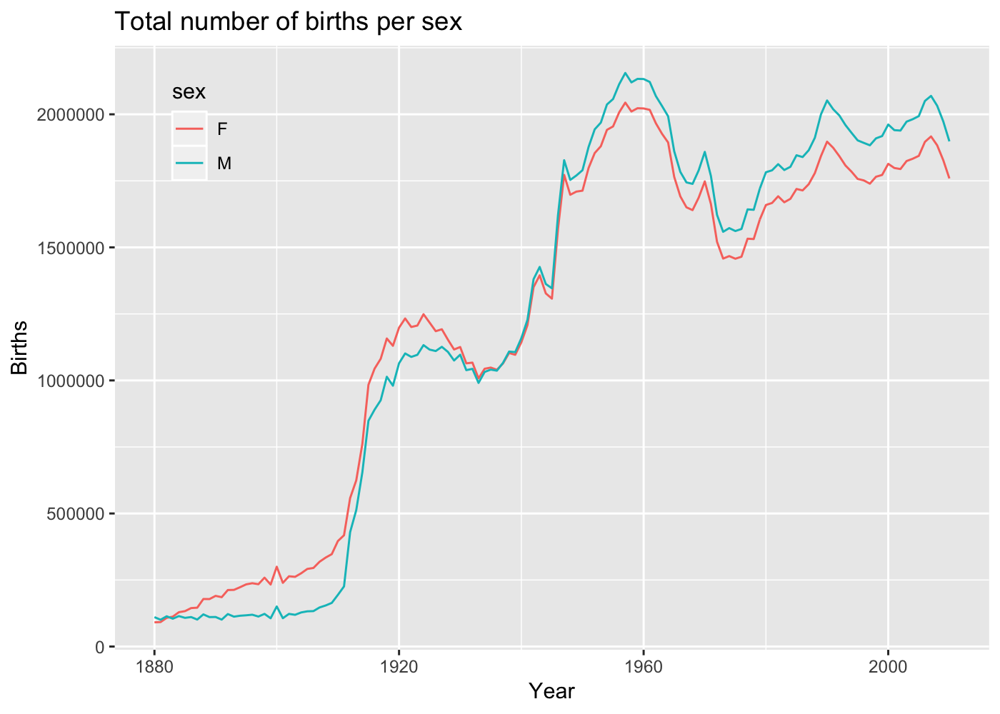
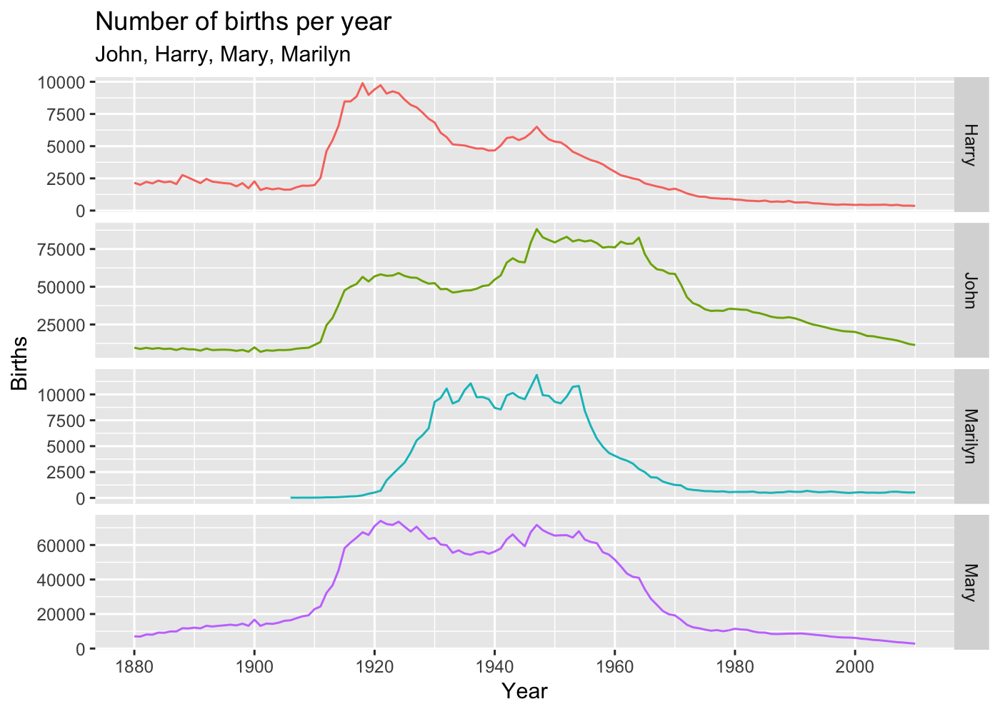
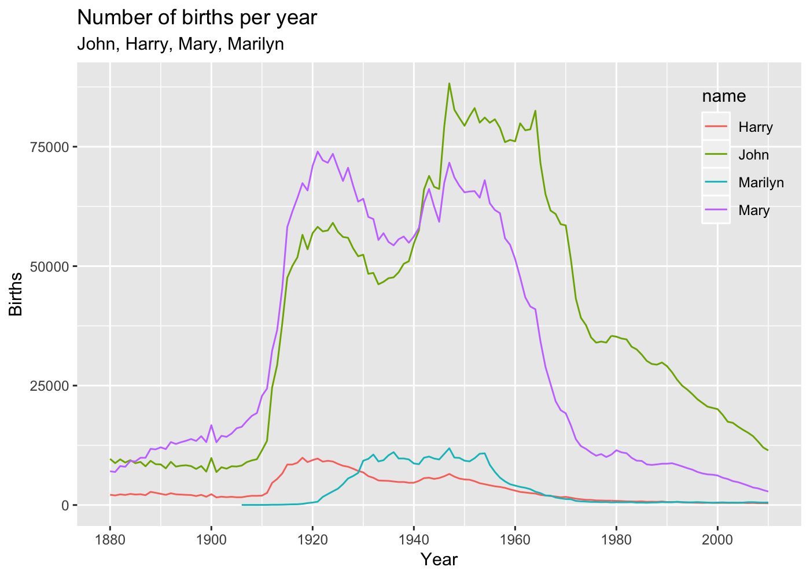
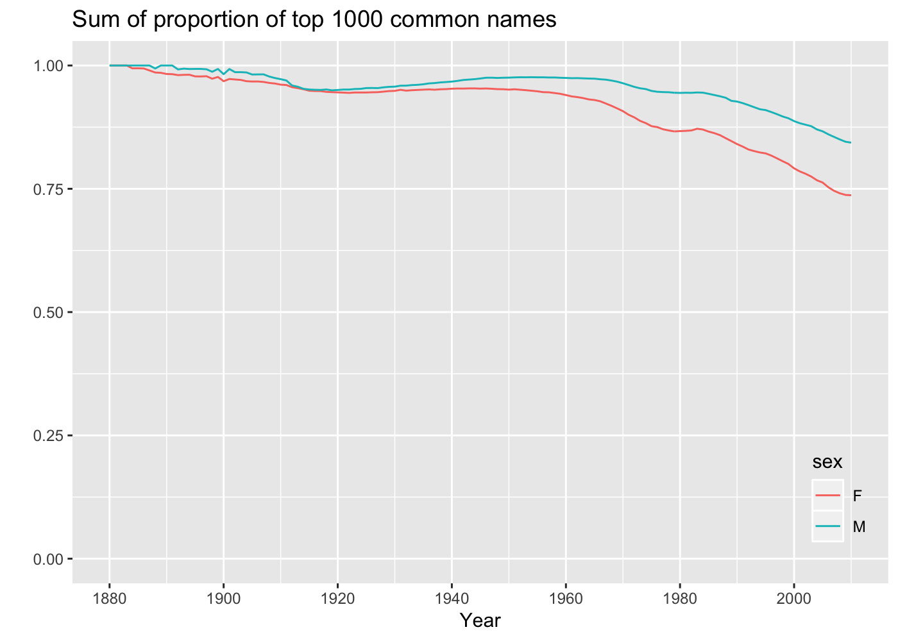
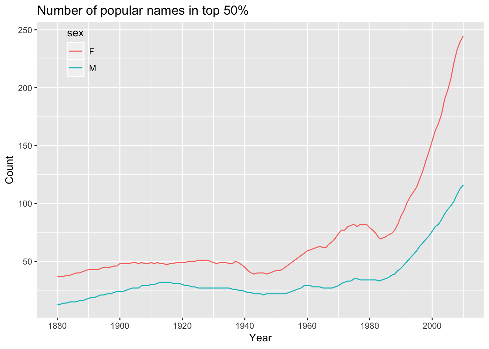

US Baby Names 1880-2010
================
Roberto Preste
2019-01-13

From the book (chapter 14.3):

> The United States Social Security Administration (SSA) has made available data on the frequency of baby names from 1880 through the present. \[...\] As of this writing, the US Social Security Administration makes available data files, one per year, containing the total number of births for each sex/name combination. The raw archive of these files can be obtained from [http://www.ssa.gov/oact/baby names/limits.html](http://www.ssa.gov/oact/baby%20names/limits.html).

------------------------------------------------------------------------

``` r
library(tidyverse)
library(magrittr)
```

------------------------------------------------------------------------

Loading the data
----------------

This dataset is split by year, so we'll assemble these files into a single dataframe, to which we'll add a new `year` column.

``` r
years <- c(1880:2010)
names <- tibble("name" = NA, "sex" = NA, "births" = NA, "year" = NA)

for (year in years) {
    path <- str_c("../datasets/babynames/yob", year, ".txt", sep = "")
    frame <- read_csv(path, col_names = c("name", "sex", "births"), 
                      col_types = cols(col_character(), col_character(), col_integer()))
    frame %<>% mutate("year" = year)
    names %<>% bind_rows(frame)
}
names %<>% drop_na()
```

``` r
names
```

    ## # A tibble: 1,690,784 x 4
    ##    name      sex   births  year
    ##    <chr>     <chr>  <int> <int>
    ##  1 Mary      F       7065  1880
    ##  2 Anna      F       2604  1880
    ##  3 Emma      F       2003  1880
    ##  4 Elizabeth F       1939  1880
    ##  5 Minnie    F       1746  1880
    ##  6 Margaret  F       1578  1880
    ##  7 Ida       F       1472  1880
    ##  8 Alice     F       1414  1880
    ##  9 Bertha    F       1320  1880
    ## 10 Sarah     F       1288  1880
    ## # ... with 1,690,774 more rows

We can now start aggregating this data by year and sex.

``` r
total_births <- names %>% 
    group_by(year, sex) %>% 
    summarise(tot_births = sum(births)) 
```

``` r
total_births
```

    ## # A tibble: 262 x 3
    ## # Groups:   year [?]
    ##     year sex   tot_births
    ##    <int> <chr>      <int>
    ##  1  1880 F          90993
    ##  2  1880 M         110493
    ##  3  1881 F          91955
    ##  4  1881 M         100748
    ##  5  1882 F         107851
    ##  6  1882 M         113687
    ##  7  1883 F         112322
    ##  8  1883 M         104632
    ##  9  1884 F         129021
    ## 10  1884 M         114445
    ## # ... with 252 more rows

Let's plot these data to view the total number of births per sex from 1880.

``` r
total_births %>% ggplot(aes(x = year, y = tot_births, color = sex)) + 
    geom_line() + 
    labs(x = "Year", y = "Births", 
         title = "Total number of births per sex") + 
    theme(legend.position = c(0.1, 0.86), 
          legend.background = element_rect(fill = "transparent"))
```



Now we'll insert a new column that will contain the proportion of babies with each name relative to the total number of births for a given year.
I had a few issues with finding a good way to apply some sort of mapping to the data, as done in the original example in Python, but I'm still quite scratching the surface of the `tidyverse`... I managed to perform a join between the `names` table and one with the total number of births per year and sex, and then calculate the desired ratio from that.

``` r
births_year_sex <- names %>% 
    group_by(year, sex) %>% 
    summarise(tot_births = sum(births))

names %<>% inner_join(births_year_sex, by = c("year", "sex"))
```

``` r
names %<>% 
    mutate(prop = births / tot_births) %>% 
    select(-tot_births)
```

``` r
names
```

    ## # A tibble: 1,690,784 x 5
    ##    name      sex   births  year   prop
    ##    <chr>     <chr>  <int> <int>  <dbl>
    ##  1 Mary      F       7065  1880 0.0776
    ##  2 Anna      F       2604  1880 0.0286
    ##  3 Emma      F       2003  1880 0.0220
    ##  4 Elizabeth F       1939  1880 0.0213
    ##  5 Minnie    F       1746  1880 0.0192
    ##  6 Margaret  F       1578  1880 0.0173
    ##  7 Ida       F       1472  1880 0.0162
    ##  8 Alice     F       1414  1880 0.0155
    ##  9 Bertha    F       1320  1880 0.0145
    ## 10 Sarah     F       1288  1880 0.0142
    ## # ... with 1,690,774 more rows

Let's subset these data to the top 1000 names for each year/sex combination.

``` r
top1000 <- names %>% 
    group_by(year, sex) %>% 
    top_n(1000, wt = births)
```

``` r
top1000
```

    ## # A tibble: 265,429 x 5
    ## # Groups:   year, sex [262]
    ##    name      sex   births  year   prop
    ##    <chr>     <chr>  <int> <int>  <dbl>
    ##  1 Mary      F       7065  1880 0.0776
    ##  2 Anna      F       2604  1880 0.0286
    ##  3 Emma      F       2003  1880 0.0220
    ##  4 Elizabeth F       1939  1880 0.0213
    ##  5 Minnie    F       1746  1880 0.0192
    ##  6 Margaret  F       1578  1880 0.0173
    ##  7 Ida       F       1472  1880 0.0162
    ##  8 Alice     F       1414  1880 0.0155
    ##  9 Bertha    F       1320  1880 0.0145
    ## 10 Sarah     F       1288  1880 0.0142
    ## # ... with 265,419 more rows

Analyzing naming trends
-----------------------

Let's first split the `top1000` dataset into boys and girls subsets.

``` r
boys <- top1000 %>% 
    filter(sex == "M")
girls <- top1000 %>% 
    filter(sex == "F")
```

We can now plot some data about occurrence of specific names during time.

``` r
top1000 %>% 
    filter((name == "John" & sex == "M") | (name == "Harry" & sex == "M") | 
           (name == "Mary" & sex == "F") | (name == "Marilyn" & sex == "F")) %>% 
    ggplot(aes(x = year, y = births, color = name)) + 
    geom_line() + 
    facet_grid(name ~ ., scales = "free_y") + 
    labs(x = "Year", y = "Births", 
         title = "Number of births per year", 
         subtitle = "John, Harry, Mary, Marilyn") + 
    scale_x_continuous(breaks = c(1880, 1900, 1920, 1940, 1960, 1980, 2000)) + 
    guides(color = FALSE)
```



``` r
# (Another useful plot for the same data might be this one. I actually prefer it better.)
top1000 %>% 
    filter((name == "John" & sex == "M") | (name == "Harry" & sex == "M") | 
           (name == "Mary" & sex == "F") | (name == "Marilyn" & sex == "F")) %>% 
    ggplot(aes(x = year, y = births, color = name)) + 
    geom_line() + 
    labs(x = "Year", y = "Births", 
         title = "Number of births per year", 
         subtitle = "John, Harry, Mary, Marilyn") + 
    scale_x_continuous(breaks = c(1880, 1900, 1920, 1940, 1960, 1980, 2000)) + 
    theme(legend.position = c(0.92, 0.8), 
          legend.background = element_rect(fill = "transparent"))
```



### Measuring the increase in naming diversity

A possible explanation for the dicrease shown in the previous plots is that fewer parents are choosing common names like Harry, John, Mary and Marilyn for their children, during latest years. Let's confirm this hypothesis with actual data.

Let's first plot the proportion of the top 1000 names to see their trend.

``` r
top1000 %>% 
    group_by(year, sex) %>% 
    summarise(tot_prop = sum(prop)) %>% 
    ggplot(aes(x = year, y = tot_prop, color = sex)) + 
    geom_line() + 
    scale_y_continuous(limits = c(0.0, 1.0)) + 
    scale_x_continuous(breaks = c(1880, 1900, 1920, 1940, 1960, 1980, 2000)) + 
    labs(x = "Year", y = "", 
         title = "Sum of proportion of top 1000 common names") + 
    theme(legend.position = c(0.94, 0.16), 
          legend.background = element_rect(fill = "transparent"))
```



This plot indeed shows a decrease in using common names roughly starting from the half of the 20<sup>th</sup> century.
Let's now take the number of distinct names, sorted by popularity, in the top 50% of births. We'll start with boys born in 2010.

``` r
df <- boys %>% 
    filter(year == 2010)
df
```

    ## # A tibble: 1,004 x 5
    ## # Groups:   year, sex [1]
    ##    name      sex   births  year    prop
    ##    <chr>     <chr>  <int> <int>   <dbl>
    ##  1 Jacob     M      21875  2010 0.0115 
    ##  2 Ethan     M      17866  2010 0.00941
    ##  3 Michael   M      17133  2010 0.00903
    ##  4 Jayden    M      17030  2010 0.00897
    ##  5 William   M      16870  2010 0.00889
    ##  6 Alexander M      16634  2010 0.00876
    ##  7 Noah      M      16281  2010 0.00858
    ##  8 Daniel    M      15679  2010 0.00826
    ##  9 Aiden     M      15403  2010 0.00811
    ## 10 Anthony   M      15364  2010 0.00809
    ## # ... with 994 more rows

``` r
df %<>% 
    arrange(desc(prop)) %>% 
    mutate(cumprop = cumsum(prop)) 
sum(df$cumprop <= 0.5) 
```

    ## [1] 116

Now we can check the same amount for boys born in 1900.

``` r
df <- boys %>% 
    filter(year == 1900)
df %<>% arrange(desc(prop)) %>% 
    mutate(cumprop = cumsum(prop))
sum(df$cumprop <= 0.5)
```

    ## [1] 24

Let's now apply this operation for every year/sex combination in the `top1000` dataset.

``` r
get_quantile_count <- function(group, q = 0.5) {
    group <- group %>% arrange(desc(prop)) %>% 
        mutate(cumprop = cumsum(prop)) 
    
    return(sum(group$cumprop <= q))
}
```

``` r
diversity <- top1000 %>% 
    group_by(year, sex) %>% 
    do(count = get_quantile_count(.)) %>% 
    mutate(count = unlist(count)) 
```

``` r
diversity
```

    ## Source: local data frame [262 x 3]
    ## Groups: <by row>
    ## 
    ## # A tibble: 262 x 3
    ##     year sex   count
    ##    <int> <chr> <int>
    ##  1  1880 F        37
    ##  2  1880 M        13
    ##  3  1881 F        37
    ##  4  1881 M        13
    ##  5  1882 F        37
    ##  6  1882 M        14
    ##  7  1883 F        38
    ##  8  1883 M        14
    ##  9  1884 F        38
    ## 10  1884 M        15
    ## # ... with 252 more rows

This new dataframe can be plotted just like before.

``` r
diversity %>% 
    ggplot(aes(x = year, y = count, color = sex)) + 
    geom_line() + 
    scale_x_continuous(breaks = c(1880, 1900, 1920, 1940, 1960, 1980, 2000)) + 
    labs(x = "Year", y = "Count", 
         title = "Number of popular names in top 50%") + 
    theme(legend.position = c(0.1, 0.9), 
          legend.background = element_rect(fill = "transparent"))
```



The plot shows that female names have always been much more diverse than male names, and this is even more evident in recent times.

------------------------------------------------------------------------

``` r
sessionInfo()
```

    ## R version 3.5.1 (2018-07-02)
    ## Platform: x86_64-apple-darwin15.6.0 (64-bit)
    ## Running under: macOS  10.14.2
    ## 
    ## Matrix products: default
    ## BLAS: /Library/Frameworks/R.framework/Versions/3.5/Resources/lib/libRblas.0.dylib
    ## LAPACK: /Library/Frameworks/R.framework/Versions/3.5/Resources/lib/libRlapack.dylib
    ## 
    ## locale:
    ## [1] en_GB.UTF-8/en_GB.UTF-8/en_GB.UTF-8/C/en_GB.UTF-8/en_GB.UTF-8
    ## 
    ## attached base packages:
    ## [1] stats     graphics  grDevices utils     datasets  methods   base     
    ## 
    ## other attached packages:
    ##  [1] bindrcpp_0.2.2  magrittr_1.5    forcats_0.3.0   stringr_1.3.1  
    ##  [5] dplyr_0.7.7     purrr_0.2.5     readr_1.1.1     tidyr_0.8.1    
    ##  [9] tibble_1.4.2    ggplot2_3.1.0   tidyverse_1.2.1
    ## 
    ## loaded via a namespace (and not attached):
    ##  [1] Rcpp_1.0.0       cellranger_1.1.0 pillar_1.3.0     compiler_3.5.1  
    ##  [5] plyr_1.8.4       bindr_0.1.1      tools_3.5.1      digest_0.6.18   
    ##  [9] lubridate_1.7.4  jsonlite_1.5     evaluate_0.11    nlme_3.1-137    
    ## [13] gtable_0.2.0     lattice_0.20-35  pkgconfig_2.0.2  rlang_0.3.0.1   
    ## [17] cli_1.0.0        rstudioapi_0.8   yaml_2.2.0       haven_1.1.2     
    ## [21] withr_2.1.2      xml2_1.2.0       httr_1.3.1       knitr_1.20      
    ## [25] hms_0.4.2        rprojroot_1.3-2  grid_3.5.1       tidyselect_0.2.5
    ## [29] glue_1.3.0       R6_2.3.0         fansi_0.3.0      readxl_1.1.0    
    ## [33] rmarkdown_1.10   reshape2_1.4.3   modelr_0.1.2     backports_1.1.2 
    ## [37] scales_1.0.0     htmltools_0.3.6  rvest_0.3.2      assertthat_0.2.0
    ## [41] colorspace_1.3-2 labeling_0.3     utf8_1.1.4       stringi_1.2.4   
    ## [45] lazyeval_0.2.1   munsell_0.5.0    broom_0.5.0      crayon_1.3.4
